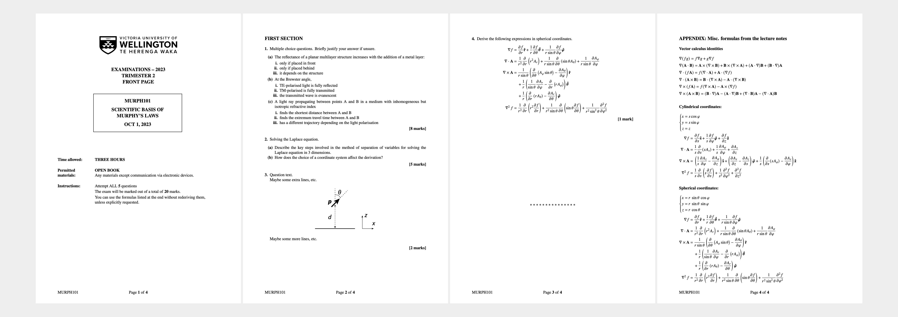

# quarto-vuwexam

Unofficial quarto template for VUW exams.

```markdown
---
title: |
  scientific basis of \
  murphy's laws
coursecode: murph101
date: 2023-10-01
year: 2023
trimester: 2
[...]
---
     
## FIRST SECTION 

1. Multiple choice questions. Briefly justify your answer if unsure. 
   #. The reflectance of a planar multilayer structure increases with the addition of a metal layer:
      #. only if placed in front
      #. only if placed behind
      #. it depends on the structure

   #. At the Brewster angle, 
      #. TE-polarised light is fully reflected 
      #. TM-polarised is fully transmitted
      #. the transmitted wave is evanescent

[...]
```

compiled with 

`quarto render exam.qmd`

becomes

[](template.pdf)

